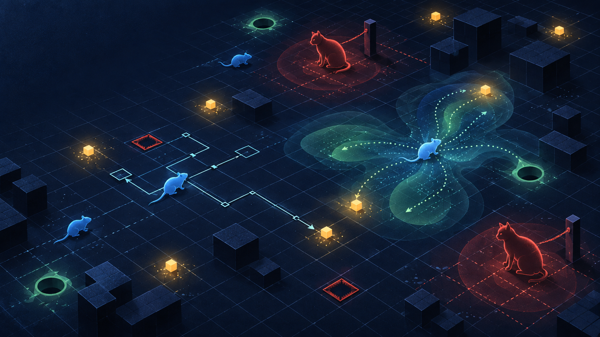
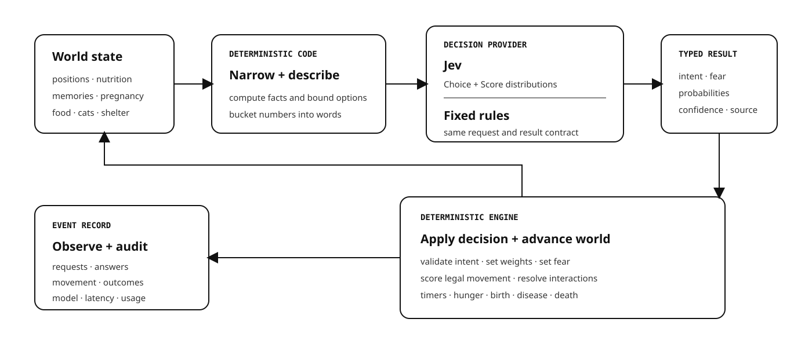
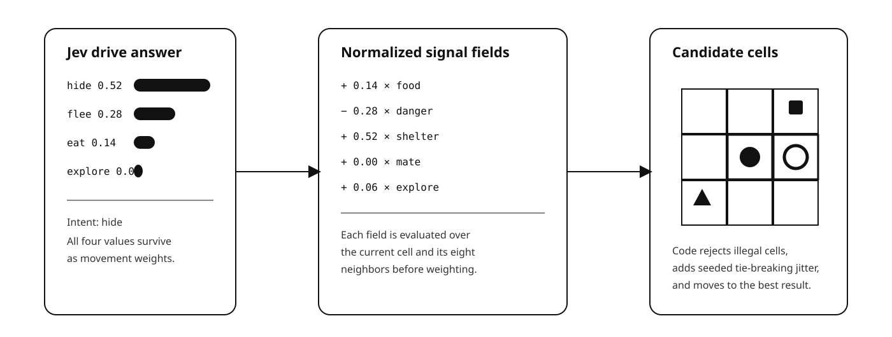

# What Happens When Judgment Replaces Rules?

## Designing the `jev-mice` cat-and-mouse ecosystem simulation with TypeSafe Jev



*`jev-mice` is a controlled experiment in combining deterministic simulation mechanics with probabilistic machine judgment.*

Most software decisions fall into one of two familiar categories. Some have a right answer that code can calculate: whether a coordinate is inside a grid, whether an account has permission, whether a balance is sufficient, or whether two values match. Others are open-ended requests for a person: explain this incident, write this message, summarize this document, or propose a plan.

There is a large and important space between them. A support request needs to be routed. A security event needs an urgency level. An agent trace needs a judgment about whether the task actually succeeded. A mouse with food to the east and a cat to the north needs to decide which pressure matters most right now. These are bounded decisions with known possible outcomes, but their inputs contain semantic ambiguity that is awkward to reduce to a durable list of `if` statements.

This is where classifiers become an architectural primitive rather than a machine-learning feature. In the broad sense I use here, a classifier reads some state and assigns it to one of a known set of meanings, actions, or levels. A useful classifier returns more than a hard label: it returns a distribution that says how strongly the evidence supports each option and how confident the model is in the judgment.

That narrow interface matters. Ordinary software can validate a finite set of outputs, compose them with facts, observe them in production, set confidence thresholds, fall back when necessary, and connect them to deterministic effects. The model interprets; the program remains in control.

## Why use a classifier at all?

A classifier is a good design choice when four things are true: the input requires semantic interpretation, the possible outputs can be bounded in advance, hand-written rules would become brittle or enormous, and the consequences of a wrong answer can be contained by the surrounding system.

The inverse boundary is just as important. A classifier should not do arithmetic, validate a schema, enforce authorization, own safety policy, mutate authoritative state, or decide whether an action is mechanically legal. If code can know the answer, code should own the answer.

### News flash: LLMs are not the center of the universe

General-purpose LLMs have become the default answer to almost every AI-shaped problem (or to almost any problem for that matter, to my dismay) but that is an architectural reflex rather than a law. An LLM is the right tool when a system needs language generation, broad reasoning, flexible tool use, or a conversational interface. It is often the wrong tool when the required output is one label, one score, or one choice from a set the program already knows.

Classifiers have been doing that work for decades. Their specialization is the point: they give up the universal text interface in exchange for constrained output, lower latency, lower cost, and behavior that is easier to measure. If a system needs to decide `hide`, `flee`, `eat`, or `explore`, generating and parsing a paragraph is unnecessary machinery.

**For classifier-shaped tasks, automatically reaching for an LLM can mean paying orders of magnitude more—in both time and money—for flexibility the caller neither needs nor wants.**

That difference is not a minor infrastructure optimization. It determines whether intelligence can sit inside a real-time loop, run across every item in a large dataset, or make thousands of small decisions without the model becoming the system's cost and latency center.

Engineers choosing a design for bounded semantic decisions have traditionally had three practical paths:

- A hand-written decision tree is fast, deterministic, and inspectable, but it recognizes only the combinations its author anticipated. As context grows, interacting thresholds turn the tree into a policy that is difficult to reason about and even harder to change safely.
- A conventional task-specific classifier can be fast and probabilistic, but it usually needs a labeled dataset, feature engineering, a training pipeline, and a separate model for each new judgment.
- A general-purpose language model can make a novel semantic judgment from instructions and context, but its native product is generated text. Software must constrain that text, parse it, validate it, handle malformed or invented values, and often make a second request for a confidence estimate that may not be well calibrated.

[Jev](https://typesafe.ai/) is TypeSafe's first public System One Model, built for this middle layer. Its interface accepts program state and structured questions, then returns typed decisions rather than prose. The [TypeSafe API](https://api.typesafe.ai/docs) exposes three question forms: `Noul` for a bounded yes-or-no judgment, `Choice` for selecting among predefined alternatives, and `Score` for placing something on a predefined scale. Choice and score answers include distributions, and answers include confidence.

### Orders of magnitude change the design space

TypeSafe's [published workflow evaluations](https://evals.typesafe.ai/) report Jev as 193.6 times faster and 444.6 times cheaper than the compared general-purpose model configurations across four structured automation workflows. TypeSafe explicitly says those figures are likely toward the high end of real-world gains, so they should not be treated as a promise for every workload. Its broader launch measurements describe System One-shaped queries as roughly 40 to 200 times faster and characterize Jev as about two orders of magnitude more efficient than comparable LLM judgment calls.

Even with that caveat, the scale of the difference is the point. A two-times improvement makes an existing design cheaper. A hundred-times improvement makes different designs possible.

In `jev-mice`, every active animal may need repeated judgments over thousands of ticks. A general LLM call at each decision point would make the language model the dominant cost, the dominant latency, and therefore the de facto center of the architecture. A fast classifier lets judgment remain one component inside the simulation instead.

Jev also changes the accessibility of classification. The conventional classifier has not disappeared, and it remains the right answer when a team has a stable task, strong labels, and the ability to train and operate a dedicated model. Jev makes classifier-shaped intelligence immediately available for new judgments: a developer defines typed questions and criteria over unstructured state instead of first collecting a task-specific dataset, designing features, training a model, and deploying a bespoke inference stack.

None of the ingredients is individually new. Semantic classification, probability distributions, confidence estimates, structured output, and fast inference all existed before Jev. What Jev brings to the table is their combination in a model and API designed specifically for machine-consumable judgment instead of wrapping an autoregressive text generator and asking it to behave like a classifier. TypeSafe describes the model as producing answers in parallel, constraining output shapes in advance, and training for calibrated decisions; its [launch article](https://typesafe.ai/blog/introducing-system-one-models-and-jev) includes both the claims and useful caveats about its published evaluations.

For AI systems engineers, this suggests a different architecture. Code can retain facts, policy, permissions, mechanics, and effects while a model handles interpretation only at explicit decision points. The model is neither an oracle nor an autonomous agent. It is closer to a probabilistic function inside a larger program.

That architecture deserves experimentation, not automatic trust. Calibration has to be measured in the target domain. Similar inputs should produce sensibly similar distributions. Uncertainty can compound across thousands of calls. A decision that looks reasonable in isolation can have surprising consequences when its result changes the state supplied to the next decision. `jev-mice` exists to make all of that visible.

## Why mice?

[`jev-mice`](https://github.com/carson-sweet/jev-mice) is an open-source, tick-based ecology on a grid. Mice forage, flee, hide, mate, remember danger, exchange warnings, carry litters, and raise pups in mouseholes. Cats prowl, select prey, stalk, pounce, eat, and eventually starve if they catch nothing. Food disappears and respawns. Traps catch the unlucky. Toxoplasmosis moves through food, mice, litters, and cats. Many local choices accumulate into a changing population.

It owes an obvious conceptual debt to John Conway's Game of Life, the cellular automaton invented by legendary Cambridge mathematician John Conway and introduced to a wide audience in [Martin Gardner's original October 1970 *Scientific American* article](https://www.ibiblio.org/lifepatterns/october1970.html). The [Game of Life Wikipedia page](https://en.wikipedia.org/wiki/Conway%27s_Game_of_Life) provides a useful history and catalogue of its rules and patterns, and [playgameoflife.com](https://playgameoflife.com/) offers a currently playable implementation. Life showed how a grid, a tiny rule set, and an initial state can produce patterns nobody explicitly designed. `jev-mice` asks a related question: what emerges when some local transitions are contextual judgments rather than fixed rules?

The project is a useful classifier laboratory for several reasons. Each animal repeatedly faces a small set of meaningful options. The simulation provides observable consequences rather than subjective impressions. The same seeded world can run with Jev or with fixed rules. Every provider decision and the major observable consequences are recorded. Most importantly, decisions form a closed loop: a judgment changes movement, movement changes encounters, encounters change hunger, fear, memory, infection, pregnancy, and survival, and those facts become the input to later judgments.

This makes `jev-mice` more revealing than a one-shot benchmark. A classifier can agree with a reference answer on a static dataset and still create a very different world once small disagreements alter its future inputs.

## The one rule that organizes the system

The governing design rule is simple:

> Code owns anything with a clear right answer. Jev is asked only bounded judgment calls, and code remains the final authority on whether the answer can execute.

The engine owns coordinates, Chebyshev distance, perception radii, nutrition arithmetic, timers, collision checks, legal neighboring cells, trap-evasion odds, gestation, population caps, food respawn, event order, and seeded randomness. Jev never moves a mouse, decrements a hunger value, creates a pup, or decides whether a pounce is in range or can cross an occupied mousehole or another cat.

For a mouse, Jev answers two questions: which currently available drive best fits this situation, and how afraid should this mouse be? For a cat, it answers which visible mouse is worth pursuing and which tactic to attempt. Everything after those judgments is code.



## From a world to a question

On each tick, the engine first resolves timers, nutrition decay, starvation, shelter exits, and immediate reflexes. A mouse adjacent to a cat does not wait for a network request before fleeing. A hungry mouse standing on food begins eating. These are reflexes with a clear right answer, so code handles them.

The remaining decision-ready animals are collected in ascending identifier order. A normal mouse holds an intent for twelve ticks before reconsidering it; a panicked mouse reconsiders after six. Cats are ready for a new judgment when they have no viable target and can see potential prey.

Before asking Jev, the engine narrows the action space. The function [`availableDrives`](../../packages/engine/src/decisions.ts) offers `eat` only when food can be smelled somewhere in the world, `flee` only when danger is visible, `hide` only when a free mousehole exists and the mouse has enough nutrition to wait, `seek_mate` only when a potential mate is visible, and `nest` only when a pregnant mouse is past term and shelter is available. `Explore` is always offered, so the set can never be empty. These checks bound the meaningful choices; the interaction code still performs final eligibility and collision checks when an animal reaches its destination.

This is more than an optimization. It gives the model a closed action vocabulary and separates a poor judgment from a mechanics bug. If `nest` was not offered, the model cannot decide that a male mouse should give birth. If a chosen mousehole becomes occupied, deterministic legality checks keep another mouse from entering it.

The engine then converts exact state into qualitative state. Nutrition `31` becomes `hungry`. A distance of three cells becomes `very close`. Age becomes `a young adult`. Coordinates become `north`, `southwest`, or another bearing. A cat becomes `stalking toward you`, `prowling`, or `about to pounce`. Memories are already sentences such as “You saw a cat catch and eat a mouse to the north, a little while ago.”

Jev does not receive raw coordinates, exact tick counts, or private rule context. Code has already calculated those facts. The model sees the representation needed to make a judgment without being invited to perform arithmetic.

The exact question wording lives in [`questions.ts`](../../packages/engine/src/questions.ts), separate from request assembly. That keeps the behavioral policy reviewable and testable. A drive has a description of what it means, when it applies, when it does not apply, and examples. For `hide`, the negative boundary is explicit: it is not for a starving mouse that would die while waiting. For `flee`, remembered danger without a visible cat is a reason to be wary, not to run.

Up to eight animals are included in one request. They are spatially sorted first so nearby agents tend to share a batch, but each animal retains its own state and independently named questions. Batching is a transport optimization, not a shared mind.

The provider boundary itself is almost deliberately boring:

```ts
const result = await client.systemOne(
  {
    state: req.state,
    questions: req.questions,
    ...(model === undefined ? {} : { model }),
  },
  { signal: controller.signal, timeout: timeoutMs },
)
```

That is the only part of the simulation that needs to know how Jev is called.

## A concrete mouse decision

Consider `m0007`, a hungry, cautious adult female. A food pile is nearby to the east. A stalking cat is very close to the north. A free mousehole is nearby to the southwest. She remembers a recent cat kill.

The state sent for that mouse looks like this, abbreviated only to keep the example readable:

```json
{
  "m0007": {
    "mouse": {
      "sex": "female",
      "age": "a grown adult",
      "hunger": "hungry",
      "personality": "Cautious: flees early, avoids any place it remembers as dangerous, and prefers to forage near where it has eaten before.",
      "condition": "moving slowly because it is hungry"
    },
    "surroundings": {
      "food": "a food pile nearby to the east",
      "cats": "a cat very close to the north, stalking toward you",
      "shelter": "a free mousehole nearby to the southwest",
      "knownTraps": "no trap you know about nearby"
    },
    "memories": [
      "You saw a cat catch and eat a mouse to the north, a little while ago."
    ]
  }
}
```

The first question is a `Choice`:

```json
{
  "drive_m0007": {
    "type": "choice",
    "instructions": {
      "question": "What should the mouse at `m0007` do right now?",
      "focus": "Weigh how hungry it is against the danger it can see or remembers, and account for its personality. Pick the one drive that fits this moment."
    },
    "criteria": {
      "eat": { "what": "Go to food and eat it." },
      "flee": { "what": "Run away from the danger." },
      "hide": { "what": "Run to a free mousehole and wait there, safe but unable to eat." },
      "explore": { "what": "Wander into unfamiliar ground looking for food, mates, or shelter." }
    }
  }
}
```

The real request includes the full `when`, `not_for`, and example criteria from the source. Only the drives admitted by the engine's bounded availability filter appear; final interaction eligibility remains in code.

A Jev answer has a typed shape like the following. These particular probabilities are illustrative, not a captured production response:

```json
{
  "drive_m0007": {
    "type": "choice",
    "choice": "hide",
    "confidence": 0.72,
    "probabilities": {
      "eat": 0.14,
      "flee": 0.28,
      "hide": 0.52,
      "explore": 0.06
    }
  }
}
```

The provider turns this into a [`DecisionSubject`](../../packages/engine/src/types.ts): the selected intent, the complete normalized weight distribution, the original per-question answer, the qualitative state the model saw, a low-confidence flag, and the fear result described below. The enclosing batch also records whether the source was Jev or the baseline, which model answered, latency, and input-token usage when available.

The most important detail is that the engine does not throw away the probability distribution after reading `choice: "hide"`. `Hide` becomes the named intent and controls whether the mouse may enter a hole, but all four probabilities shape movement. A mouse judged 52 percent inclined to hide, 28 percent inclined to flee, and 14 percent inclined to eat behaves differently from a mouse given a one-hot `hide` command.

## Fear is not another name for fleeing

The same mouse receives a second, simultaneous question:

```json
{
  "fear_m0007": {
    "type": "score",
    "instructions": {
      "question": "How afraid should the mouse at `m0007` be right now?",
      "focus": "Judge fear from what it can see and what it remembers, and from its personality. This is about how much room it should give danger, not about what it should do."
    },
    "criteria": [
      { "what": "Unconcerned. Nothing threatening in sight or in memory." },
      { "what": "Wary. Something is off, but nothing immediate." },
      { "what": "Alarmed. Real danger is present or freshly remembered." },
      { "what": "Panicked. Danger is immediate and close." }
    ]
  }
}
```

An illustrative answer might be:

```json
{
  "fear_m0007": {
    "type": "score",
    "score": 2,
    "confidence": 0.86,
    "probabilities": {
      "0": 0.02,
      "1": 0.10,
      "2": 0.76,
      "3": 0.12
    }
  }
}
```

The provider rounds and clamps the score to the ordered fear rubric, making this mouse `alarmed`. Fear does not choose the action. It changes how far danger is felt and how soon the mouse will reconsider its intent.

There is a subtle implementation lesson here. Every candidate movement cell receives a danger value, and those values are min-max normalized across the candidate cells. Multiplying the whole danger field by a fear constant would have no effect because normalization would cancel the multiplier. The engine instead divides distance inside the quadratic falloff: `quadratic(distance / fearFactor)`. That changes the shape of the field, so a panicked mouse gives danger a wider berth than an unconcerned one even after normalization.

Disease modifies the answer after either provider returns it. An infected mouse becomes one fear level calmer, modeling the reduced aversion associated with toxoplasmosis. Applying this in the engine rather than in the Jev prompt or the fixed rules guarantees that the disease affects both deciders identically.

## Probabilities become motion

For a mouse at `(x, y)`, the engine considers the current cell and the eight neighboring cells that remain inside the grid. It calculates five fields at each candidate:

- Food attraction uses a linear distance falloff over present food piles, with unknown live traps contributing a weaker, deceptive food signal.
- Danger uses a quadratic falloff over perceived cats and known traps, reshaped by fear.
- Shelter attraction uses a linear falloff over free mouseholes.
- Mate attraction uses a linear falloff over potential opposite-sex adult mates in perception.
- Exploration favors continuing in the direction implied by the mouse's recent movement.

Each field is normalized across the candidate cells. The returned drive probabilities then combine them:

```text
total = eat_weight × food
      − flee_weight × danger
      + (hide_weight + nest_weight) × shelter
      + seek_mate_weight × mate
      + explore_weight × explore
```



The engine rejects occupied and illegal cells, restricts mousehole entry to `hide` and `nest`, adds a small seeded jitter to break ties, and selects the highest-scoring remaining candidate. A fed mouse can move every tick, a hungry mouse every two ticks, and a starving mouse every three. The choice of intent influences the route, but geometry and movement remain deterministic given the decision record and random seed.

## Cats use the same pattern

Cats have a different decision surface, but the architecture is identical. Code calculates which mice fall within the cat's current perception radius and describes each candidate in words. A candidate might be “moving slowly because it is hungry, alone, very close to the southeast.” The exact coordinates and nutrition value remain private to code.

Jev receives two `Choice` questions. The first asks which mouse is worth pursuing and includes `none_worth_it` as a legitimate answer. The second asks the cat to choose `prowl`, `stalk`, `pounce`, or `rest`.

An illustrative response looks like this:

```json
{
  "target_c0001": {
    "type": "choice",
    "choice": "m0019",
    "confidence": 0.81,
    "probabilities": {
      "m0007": 0.12,
      "m0019": 0.74,
      "none_worth_it": 0.14
    }
  },
  "mode_c0001": {
    "type": "choice",
    "choice": "pounce",
    "confidence": 0.78,
    "probabilities": {
      "prowl": 0.05,
      "stalk": 0.14,
      "pounce": 0.78,
      "rest": 0.03
    }
  }
}
```

The engine verifies that `m0019` still exists, is outside a mousehole, and remains within the cat's actual perception. It applies the chosen target and requested mode, then deterministic cat mechanics take over. A requested pounce executes only when range and cooldown permit it; otherwise it degrades to a one-cell stalk. A chosen stalk does not become an automatic pounce. Code prevents cats from crossing mouseholes or other cats, resolves capture, starts the eating timer, restores nutrition, and records the observable consequences.

Jev chooses the prey and tactic to attempt. Code can veto an impossible pounce, but it does not silently upgrade a chosen stalk into one.

## The rules are a control, not a lesser engine

The fixed baseline implements the same `DecisionProvider` interface as Jev and returns the same `DecisionBatch` and `DecisionSubject` structures. The simulation has one execution path after a decision comes back. This is what makes the comparison honest: switching the decider does not silently switch movement, hunger, reproduction, or any other mechanic.

The mouse baseline is an ordered ladder. A cat within two cells and no reachable shelter produces weights of roughly 85 percent flee and 15 percent explore. A cat and mousehole both within four cells produce 70 percent hide and 30 percent flee. Nutrition below 30 makes eating 90 percent of the result. A due pregnancy makes nesting 80 percent. Nutrition below 60 makes eating a less urgent 65 percent. A fed mouse with a potential mate and no close cat receives 60 percent seek-mate. Otherwise it explores.

There is also a danger floor. If a cat is visible but another row wins, the baseline preserves some flee weight so the danger term never disappears from movement. Without it, a fed mouse with a cat at middle distance could choose `explore` and then score its neighboring cells as if the cat did not exist.

Fear is read directly from cat distance: adjacent is panicked, two through four cells is alarmed, five through eight is wary, and a fresh danger memory keeps a mouse wary after the cat is gone. Otherwise it is unconcerned.

The cat baseline minimizes `distance + nutrition / 20`. Because hungry mice move more slowly, their lower nutrition makes them effectively cheaper prey even when they are slightly farther away. The cat pounces when the selected mouse is within three cells and stalks otherwise.

The rules are extremely useful. They are fast, cheap, reproducible from a seed, legible in unit tests, and available when no Jev key is configured. They are also structurally limited. Their thresholds create sharp behavioral boundaries, they use only the variables their author wired in, and they do not interpret the full prose situation or personality in the contextual way Jev can.

The baseline doubles as the failure path. If Jev times out, the provider throws, a response is incomplete or invalid, or an external budget is exhausted, the affected batch receives a rules answer. A sibling batch that succeeded keeps its Jev answer. The event stream records `source: "jev"` or `source: "baseline"` and records timeout, error, or quota reasons separately, so computed behavior is not presented as judged behavior.

## The ecology Jev does not control

Jev supplies only a few bounded judgments, but those judgments act inside a fairly rich ecology.

### Hunger and food

* Every mouse loses nutrition each tick. Fed, hungry, and starving bands govern movement speed as well as reporting. Eating takes three ticks, consumes a food pile, and restores nutrition to 100. Depending on configuration, food later respawns at a new legal cell or remains absent. A mouse reaching zero nutrition dies.
* Cats have independent nutrition. A mouse restores half a cat's maximum nutrition, so a cat must keep hunting. Below half nutrition, a cat sees farther, can pounce from farther away, recovers its pounce sooner, and does not rest after losing prey. A cat that catches nothing eventually starves, which is the only way predation pressure leaves the world.

### Fear, personality, and memory

* Fear changes the danger gradient and decision cadence. Personality supplies a semantic description to Jev, but some personality effects are mechanical too. Vigilant mice perceive farther. Social mice exchange alarms over a longer range. Bold and cautious distinctions are primarily available to the judgment provider rather than reimplemented as a second hidden rule system.
* A mouse retains at most five memories, and each expires after 300 ticks. It can remember a trap death, a cat kill, or its own narrow escape. Memories are stored as sentences because that is the form the decision model reads. Nearby mice exchange the freshest firsthand danger memory, but hearsay is not relayed again. That small provenance rule prevents one observation from echoing forever through the population.

### Shelter and reproduction

* A free mousehole can hold one adult or one brood. A hidden mouse is safe but cannot eat, so adults and pups leave when nutrition drops below the fed threshold. This is why `hide` is withheld from a hungry mouse: offering it would create a loop in which the mouse enters shelter, is immediately ejected by hunger, and chooses shelter again.
* Mating begins when an adult with `seek_mate` reaches an eligible opposite-sex partner, the partner is not eating or fleeing, and a free mousehole lies within three cells. Both animals are occupied for five ticks, and the female begins a 60-tick gestation. Once past term, she must receive `nest`, reach a free hole, and complete a five-tick birth.
* A litter contains two to four pups, determined by the seeded random stream and capped by world capacity. Pups begin inside the mousehole with their own sex and personality. The mother remains outside. The brood leaves shelter as hunger rises.

### Traps and disease

* A mouse entering an active trap receives an evasion roll equal to half its current nutrition fraction. A well-fed mouse has at most a 50 percent chance; hunger makes escape less likely. A death becomes a visible danger memory for witnesses. A narrow escape becomes a private memory for the survivor.
* Food may carry toxoplasmosis. An infected mouse burns nutrition 20 percent faster and becomes one fear level calmer. Infection is permanent in the simulation and can pass from mother to individual pups with a seeded probability. A cat that eats an infected mouse begins shedding into the environment, which raises the chance that future food piles appear contaminated. The parasite therefore closes another loop: infection alters fear and hunger, those alter movement and capture, capture changes shedding, and shedding changes later infection pressure.

The critical architectural point is that none of this lives inside Jev. The provider sees the qualitative consequences it needs for judgment. The engine remains the authority on disease, timers, transmission, eligibility, and effects.

## The platform around the simulation

The repository is split so the pure decision experiment does not become entangled with hosting or presentation.

[`packages/engine`](../../packages/engine) is a seeded state machine with no clock, network, browser, or storage dependency. Every loop that draws randomness runs in stable agent order. Its public surface creates or restores an engine, advances it, returns a world view, drains events, serializes snapshots, and exposes a few diagnostic seams used by tests.

[`packages/provider-jev`](../../packages/provider-jev) is the adapter around TypeSafe. It receives engine requests, sends only `state` and `questions`, validates answer kinds, normalizes positive probabilities to sum to one, maps fear scores to named levels, records model and usage metadata, and returns baseline decisions on failure. It holds no simulation state and no API key.

[`apps/sim`](../../apps/sim) owns the run loop. It advances ticks, turns raw events into live frames and readable decision lines, drains events into bounded chunks, snapshots the engine, uploads through coordinator-provided URLs, and builds reports and exports. A slow run remains watchable because frame delivery is bounded by elapsed time as well as requested tick cadence.

[`apps/host`](../../apps/host) is the local Node host used for development and local runs. It reads the TypeSafe key server-side, serves the run API and web build, and never exposes the key to the browser. [`apps/worker`](../../apps/worker) is the Cloudflare deployment path, using the same dependency-free engine and fetch-compatible provider. [`apps/web`](../../apps/web) supplies configuration, the live grid, population chart, event log, live mouse-decision inspector, playback controls over buffered frames, run library, stored turn history, and reports. Cat decisions remain available in the stored event data even though the compact live inspector currently shows mice only.

The event stream covers provider decisions and major observable consequences with a tick and sequence number: decision requested, decision returned, fallback, movement, food eaten, capture, death, memory added, mating, birth, infection, shelter entry, and run completion. Continuous internal changes such as age and nutrition decay are represented in snapshots and summaries rather than as one event per value change. Decision events retain the state, offered options, typed answers, weights, source, confidence, model, timing, and usage needed to inspect why the engine behaved as it did.

This supports two different properties that are easy to confuse. A fixed-rules run is reproducible from its configuration and seed. A Jev run is not guaranteed to make identical judgments if called again with the same seed, but its recorded decisions, event chunks, summaries, and snapshots make the completed run inspectable and auditable. They are also the foundation for a future deterministic replayer; the current product offers live frame scrubbing and stored turn history, not full re-execution of a completed Jev run from its recorded answers.

## What should be compared?

The clean provider boundary lets an experiment hold the world configuration and seed constant while switching only the decision system. That enables measurement at two levels.

At the decision level, we can measure what animals choose under immediate danger, how fear is distributed, how confidence changes with ambiguity, how often fallbacks occur, how long inference takes, and how much input each run consumes. We can also compare distributions rather than merely top choices. Two providers that both select `hide` may disagree profoundly about whether eating or fleeing was almost as compelling.

At the ecology level, we can compare survival, extinction time, population curves, births, starvation, predation, trap deaths, infection prevalence, and which personality lines persist. These are not automatically measures of intelligence. A decider that keeps more mice alive might be better at self-preservation, or it might simply reproduce less and avoid population pressure. The event record is needed to interpret the aggregate.

One run is not evidence. Seeded placement and random events can put a colony on very different trajectories, and Jev adds variation at the decision boundary. Comparisons need repeated seeds, explicit configuration, source-labeled decisions, and separate reporting for local behavioral quality and global ecological outcomes.

The distinction matters: a provider can make locally plausible decisions and still produce an unstable ecosystem. Conversely, a crude rule can accidentally produce a resilient population for reasons that have little to do with intelligent behavior.

## What this design teaches

* **Narrow the asks.** This, honestly, is probably the biggest indicator of vibe-coded AI systems that haven't been competently designed - just lob it all in and let the model figure it out. Sending a whole world to Jev (or any model) and asking it to “play” creates an opaque system in which arithmetic mistakes, illegal actions, and poor judgment are indistinguishable. Computing facts and bounding the options first makes the model responsible for *only* the part worth learning about.
* **Translate facts into the model's form of judgment**. Exact state belongs in code, but a semantic decision model can often judge `very close`, `hungry`, and `stalking toward you` more effectively than coordinates and counters that invite unnecessary calculation. This is what a model built for semantic classification is good at.
* **Preserve distributions**. The top choice is useful for discrete gates such as entering a mousehole. The full distribution is more useful for behavior that should *blend* competing pressures, and that's where the richness comes from. A calibrated distribution—52% hide, 28% flee, 14% eat, and 6% explore—contains more engineering value than the word `hide` alone.
* **Use contracts**. The fixed rules make testing possible, provide graceful degradation, and reveal whether Jev is adding anything. A compelling AI animation without a baseline is a demonstration, not an experiment.
* **Manage exceptions as quality concerns.** One unanswered request should affect one batch, not halt the world. Timeouts, malformed answers, quotas, and missing subjects are normal operating conditions for a model dependency.
* **Record decision boundaries.** A model-in-the-loop system needs more than final outcomes. It needs the state the model saw, the options it was offered, the distribution it returned, its confidence and source, and the events that followed. Without that chain, emergent behavior becomes storytelling.

## What's next: local classifiers and SLMs

As fun as one might find playing with this simulation, there's more to learn.

The next experiments might be to put a local classifier or small language model behind the same `DecisionProvider` interface. Kev, Laya, and Von are possible candidates. If someone does this, the implementation should treat a local classifier as a first-class source rather than disguising its decisions as rules.

The contract makes the experiment straightforward in principle. A local provider receives the same qualitative state and typed questions and returns the same `DecisionBatch`: choice and score answers, probability distributions, confidence, intent, fear, and source metadata. The engine should not need to know which model answered.

The comparison should cover agreement with Jev, distribution calibration, inference latency, throughput, memory and hardware requirements, cost, determinism, offline operation, and ease of adaptation from recorded decisions. Existing telemetry can become an offline corpus of situations, inputs, Jev answers, rules answers, and eventual outcomes.

Offline imitation is only the first gate. A local model may match Jev on a high percentage of recorded decisions and still create a different ecology in closed loop. The first disagreement changes a movement, that movement changes an encounter, and the original recorded future is no longer the future the model sees. The real evaluation must therefore include full simulations across matched configurations and seeds.

That is the broader reason to study systems like this. The interesting question is not merely whether a classifier can label a situation correctly. It is whether probabilistic judgment can be made into a dependable software component, and what happens when thousands of those judgments become causes in a living system.

## An invitation to play, dissect, learn, and contribute

56 years ago, almost to the day, Conway's Game of Life showed how much complexity can emerge from a few local rules. `jev-mice` is an experiment in what emerges when a few of those local transitions become contextual "fuzzy" judgments—while the rest of the world stays firmly in deterministic code.

You can [play with the live simulation](https://mice.jev.carsonsweet.com), run the same world with Jev and the fixed rules, and inspect the decisions behind what you see. The [source is open](https://github.com/carson-sweet/jev-mice), including the engine, provider contract, tests, viewer, reports, and deployment path. Contributions and forks are encouraged (just mind attribution, please), especially around local classifier providers, calibration and evaluation harnesses, behavioral measures, visualization, and new ecological experiments.

I also love hearing from people working on SLMs, agent architecture, calibrated decision models, cognitive architecture, or the boundary between learned judgment and deterministic control.


---


## References and links

- [TypeSafe AI: Jev and System One Models](https://typesafe.ai/)
- [TypeSafe API documentation](https://api.typesafe.ai/docs)
- [Introducing System One Models and Jev](https://typesafe.ai/blog/introducing-system-one-models-and-jev)
- [TypeSafe workflow evaluations](https://evals.typesafe.ai/)
- [Martin Gardner's original October 1970 *Scientific American* article on Conway's Game of Life](https://www.ibiblio.org/lifepatterns/october1970.html)
- [Conway's Game of Life on Wikipedia](https://en.wikipedia.org/wiki/Conway%27s_Game_of_Life)
- [Play Conway's Game of Life](https://playgameoflife.com/)
- [Play `jev-mice`](https://mice.jev.carsonsweet.com)
- [`jev-mice` source code](https://github.com/carson-sweet/jev-mice)


## AI disclosure

This article was conceptualized and outlined by Carson Sweet, with AI assistance for drafting, editing, and diagram generation.
